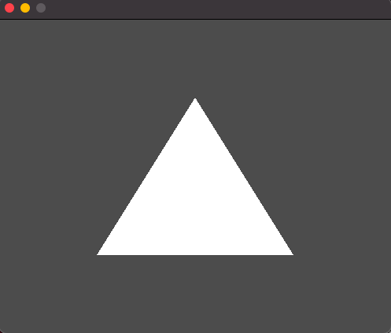

# fltk-rs-demos

This is a repo for fltk-rs demo examples. These are usually associated with video tutorials from this [playlist](https://www.youtube.com/playlist?list=PLHqrrowPLkDu9U-uk60sGM-YWLOJFfLoE) on youtube.

Also the fltk-rs repo has an [examples directory](https://github.com/MoAlyousef/fltk-rs/tree/master/fltk/examples) for several standalone examples. These demo apps mainly show interop with other projects in the Rust ecosystem.

The current demos include:
- web-todo: Creating an async web todo app using fltk, reqwest, serde and tokio.
- libvlc: Creating a media player using fltk and the vlc crate.
- musicplayer: Creating a music player using custom widgets and the soloud crate. 
- opengl: Raw OpenGL drawing in an fltk GlWindow.
- gl_loader: Use the gl crate (An OpenGL function pointer loader) to do OpenGL drawing.
- wgpu: Use wgpu-rs for gpu accelerated drawing.
- pixels: Use the pixels crate to draw a wgpu accelerated framebuffer.
- framebuffer: Using fltk for framebuffer drawing.
- pixels: Create live drawn animations using the pixels crate.
- plotters: Use plotters for live plotting (drawing animations) with fltk.
- raqote: Use raqote for custom drawing.
- tinyskia: Use tiny-skia for custom drawing.

The demos can be run by accessing any of the directories and running:
```
cargo run
```

## Screenshots:
- musicplayer:

- web-todo:

- libvlc

- opengl

- gl_loader

- pixels

- plotters

- raqote

- tinyskia
