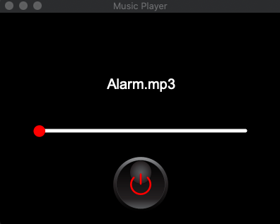
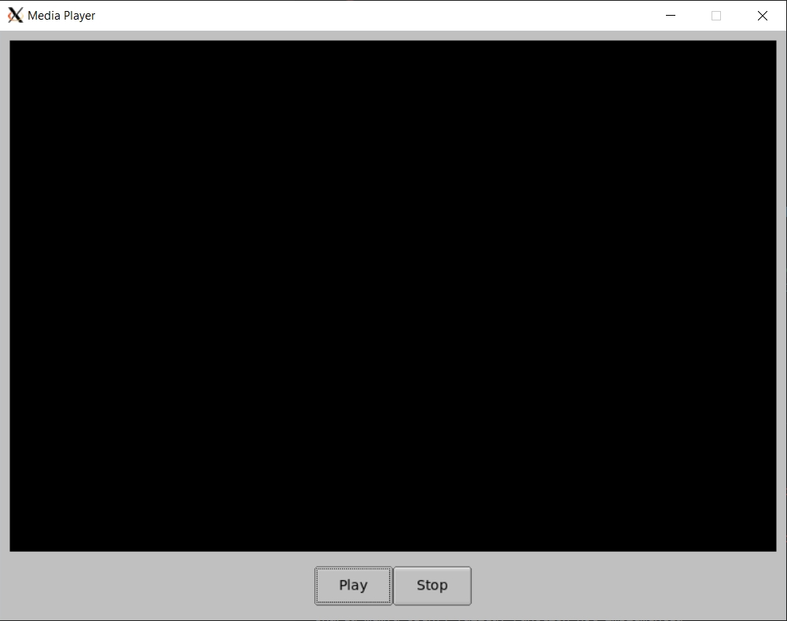
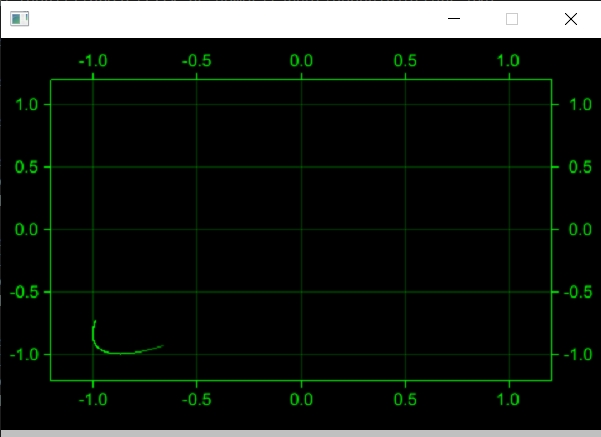
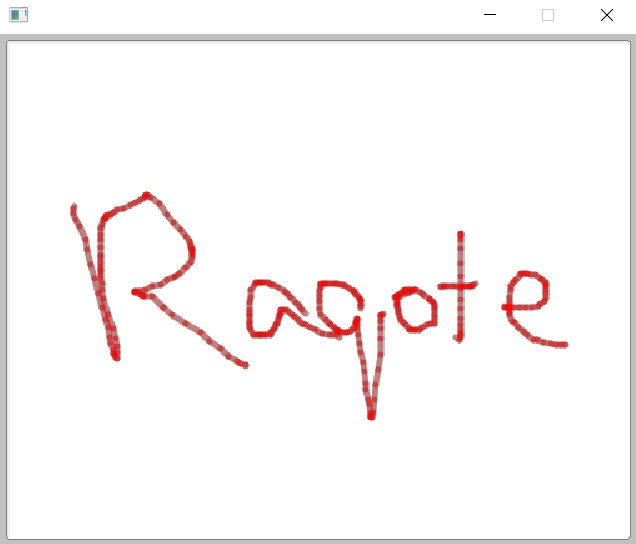
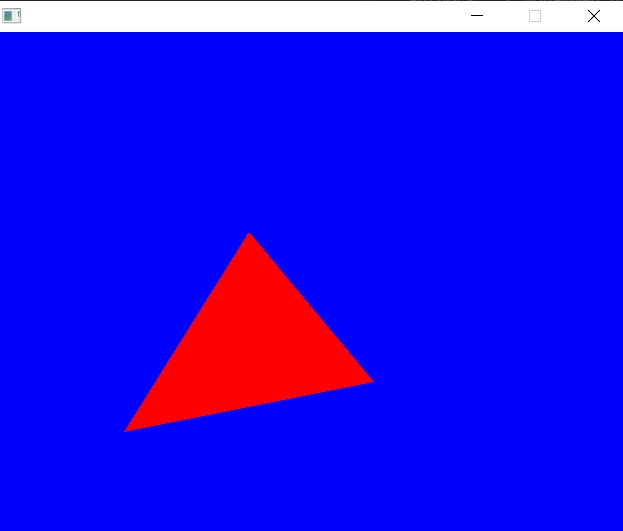
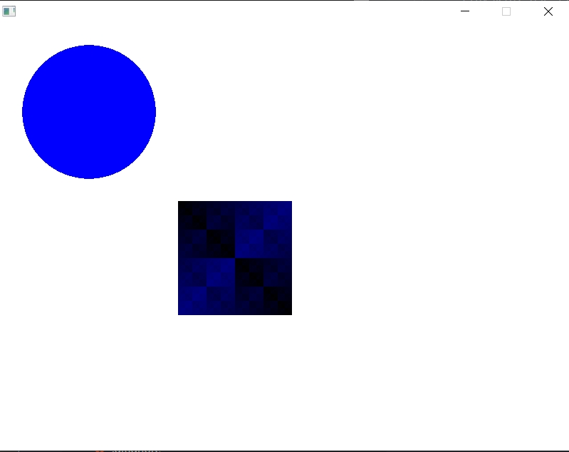
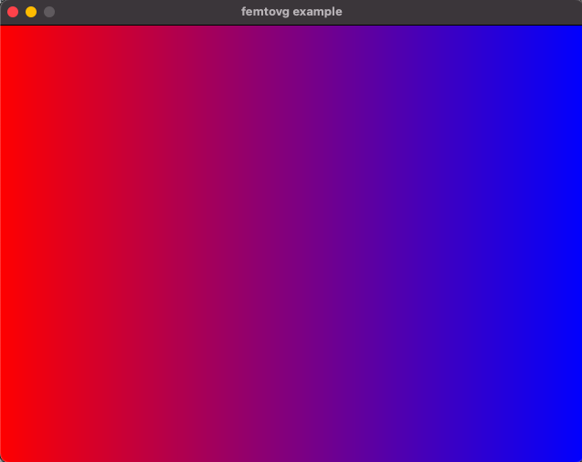

# fltk-rs-demos

This is a repo for fltk-rs demo examples. These are usually associated with video tutorials from this [playlist](https://www.youtube.com/playlist?list=PLHqrrowPLkDu9U-uk60sGM-YWLOJFfLoE) on youtube.

Also the fltk-rs repo has an [examples directory](https://github.com/MoAlyousef/fltk-rs/tree/master/fltk/examples) for several standalone examples. These demo apps mainly show interop with other projects in the Rust ecosystem.

The current demos include:
- web-todo: Creating an async web todo app using fltk, reqwest, serde and tokio.
- web-todo2: Creating an async web todo app using fltk, surf, serde and async-std.
- libvlc: Creating a media player using fltk and the vlc crate.
- musicplayer: Creating a music player using custom widgets and the soloud crate. 
- opengl: Raw OpenGL drawing in an fltk GlWindow.
- glut: Use the gl crate (An OpenGL function pointer loader) to do OpenGL drawing.
- wgpu: Use wgpu-rs for gpu accelerated drawing.
- pixels: Use the pixels crate to draw a wgpu accelerated framebuffer.
- framebuffer: Using fltk for framebuffer drawing.
- plotters: Use plotters for live plotting (drawing animations) with fltk.
- raqote: Use raqote for custom drawing (paint example).
- tinyskia: Use tiny-skia for custom drawing.
- systray: Use nwg to create an fltk app with systray functionalities on Windows.
- glow: Use the glow crate to do OpengGL drawing.
- glium: Use the glium crate for OpenGL drawing.
- calendar: Uses the chrono crate to create an fltk calendar dialog.
- image: Uses rust-embed and the image crates to load images into fltk.
- speedy2d: Uses speedy2D crate to do 2D drawings of a circle and an RGB image in a GlutWindow.
- femtovg: Uses femtovg for 2D drawing in a GlutWindow.

The demos can be run by accessing any of the directories and running:
```
cargo run --release
```

## Screenshots:
- musicplayer:

- web-todo:

- libvlc

- opengl

- glut

- pixels

- plotters

- raqote

- tinyskia

- glow

- glium

- calendar

- speedy2d

- femtovg

