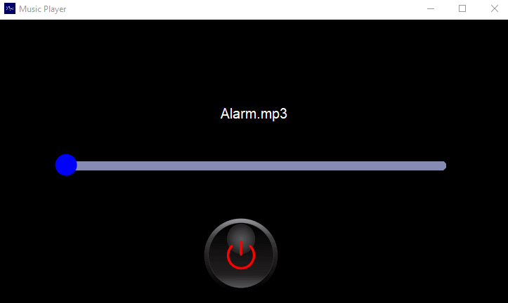
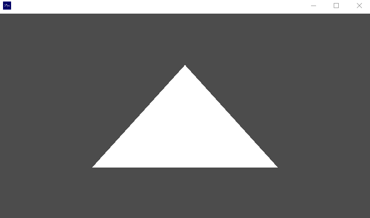
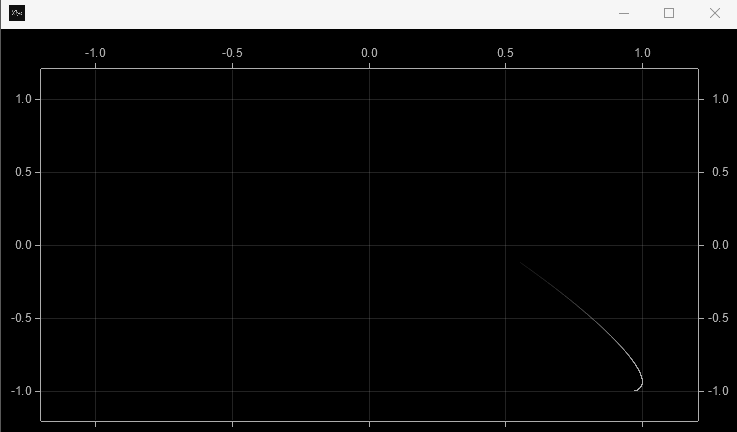
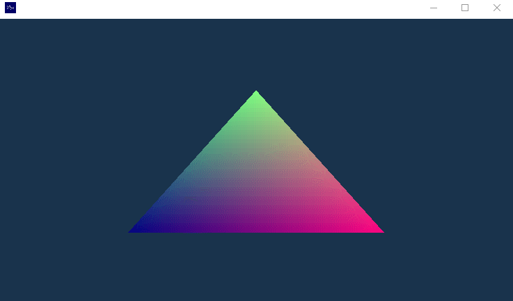
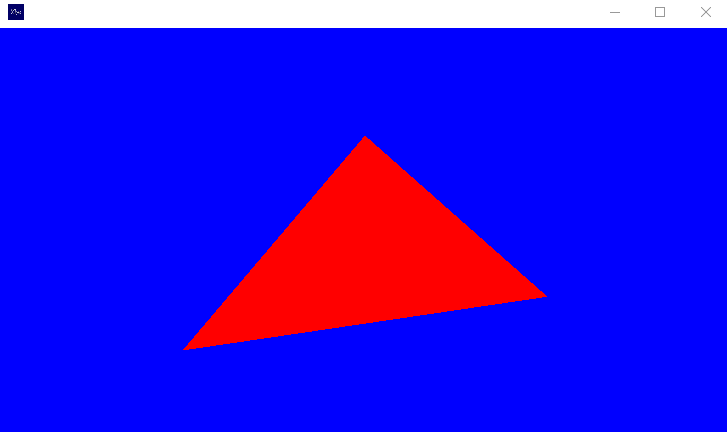
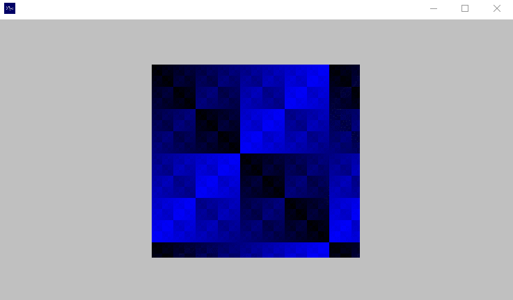
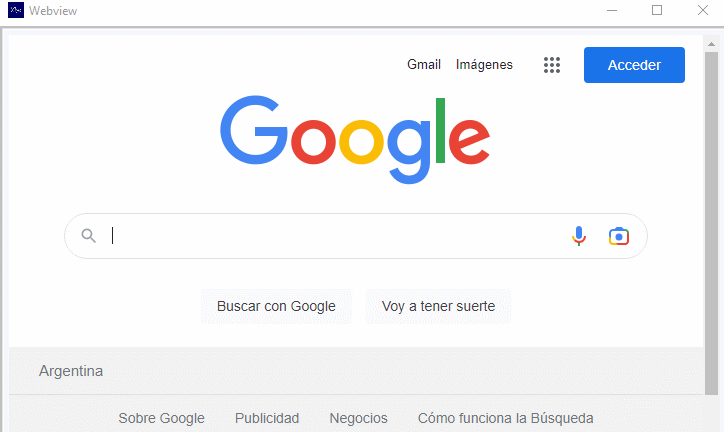
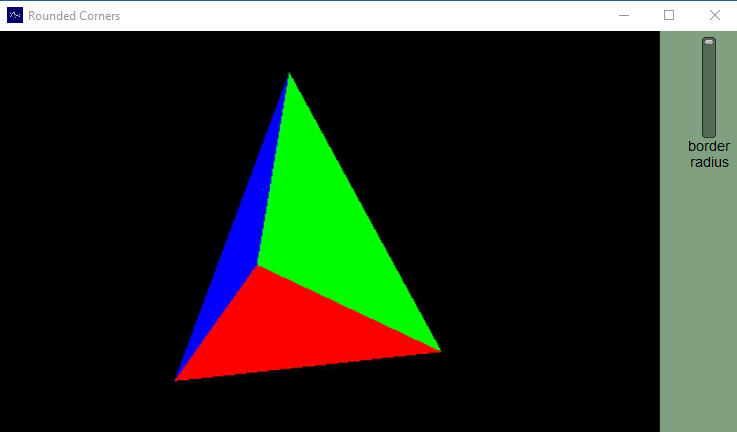
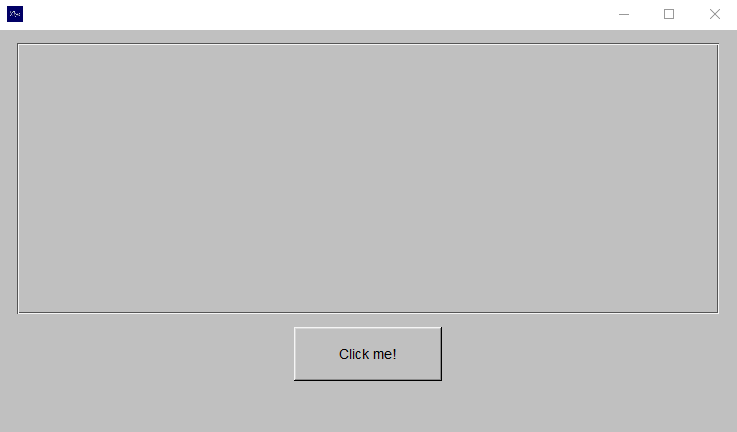
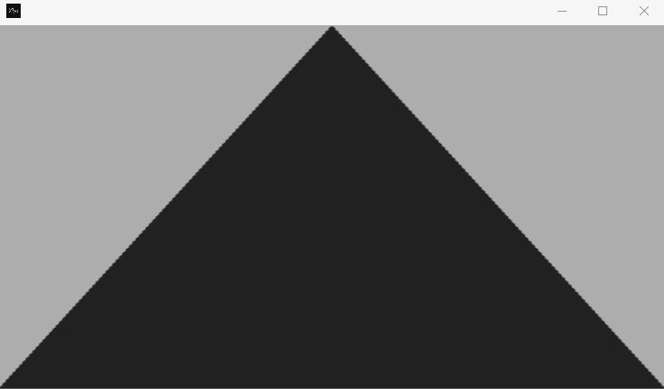

<div align="center">
  
  <h1 id="title">fltk-rs demos</h1>

  [](https://docs.rs/fltk)
  [](https://crates.io/crates/fltk)
  [](https://github.com/fltk-rs/fltk-rs/blob/master/LICENSE)
  [](https://github.com/fltk-rs/fltk-rs/actions)
</div>

---
<div style="text-align: justify;">

This repository contains demos and examples of applications built with fltk-rs, a user interface library in Rust based on the Fast Light Toolkit (FLTK).

These are usually associated with video tutorials from this  on youtube. Also the fltk-rs repo has an [examples directory](https://github.com/fltk-rs/fltk-rs/tree/master/fltk/examples) for several standalone examples. These demo apps mainly show interop with other projects in the Rust ecosystem.


### Content

The demos and examples in this demo show the ability of fltk-rs to interact with other projects in the Rust ecosystem. The following resources are provided:

- Video Tutorials – To make it easy to learn fltk-rs, a tutorial [playlist](https://www.youtube.com/playlist?list=PLHqrrowPLkDu9U-uk60sGM-YWLOJFfLoE) has been created on YouTube that shows how to use the library and develop applications with it.

- Samples directory – Within the fltk-rs repository is a [examples directory](https://github.com/fltk-rs/fltk-rs/tree/master/fltk/examples) that includes stand-alone samples of how to use different components of the library. Examples range from simple windows to more advanced applications with multiple windows and complex controls.

- Demo apps – In addition to the code examples, this demo provides a number of demo apps that demonstrate fltk-rs' ability to integrate with other projects in the Rust ecosystem. These apps include examples of integration with popular projects like Reqwest, Serde, Tokyo, and many others.

### Requirements

To use the demos and examples in this repository, you need to have Rust and the Cargo package manager installed. If you don't have them installed, you can follow the
[official instructions ](https://www.rust-lang.org/tools/install)to install Rust and Cargo on your system.

### Install

To install and run the demos and examples in this repository, follow these steps:

1. Clone this repository to your local machine:

```bash
git clone https://github.com/fltk-rs/demos.git
```

2. Navigate to the cloned directory:

```bash
cd demos
```

3. Compile and run the desired demo:

```bash
cargo run --release
```

### Contribute

If you would like to contribute more examples or improvements to this demo, please create a new fork of the repository and submit your changes via a pull request. We greatly appreciate your contribution and support of the Fltk and the Rust community. It is appreciated to add at the end of the examples, yours with a demonstration via gif and the title of the repository as shown below.

### License

This repository is licensed under the MIT license. You can get more information about the license terms in the LICENSE file of this repository.

---

The current demos include:
- <a href="#web-todo">🌐 web-todo: </a>Creating an async web todo app using fltk, reqwest, serde and tokio.
- <a href="#web-todo2">🌐 web-todo2: </a>Creating an async web todo app using fltk, surf, serde and async-std.
- <a href="#libvlc">📺 libvlc: </a>Creating a media player using fltk and the vlc crate.
- <a href="#musicplayer">🎶 musicplayer: </a>Creating a music player using custom widgets and the soloud crate.
- <a href="#opengl">🎨 opengl: </a>Raw OpenGL drawing in an fltk GlWindow.
- <a href="#glut">🖌️ glut: </a>Use the gl crate (An OpenGL function pointer loader) to do OpenGL drawing.
- <a href="#wgpu">🖊️ wgpu: </a>Use wgpu-rs for gpu accelerated drawing.
- <a href="#pixels">🎞️ pixels: </a>Use the pixels crate to draw a wgpu accelerated framebuffer.
- <a href="#framebuffer">✒️ framebuffer: </a>Using fltk for framebuffer drawing.
- <a href="#plotters">🌌 plotters: </a>Use plotters for live plotting (drawing animations) with fltk.
- <a href="#raqote">🌈 raqote: </a>Use raqote for custom drawing (paint example).
- <a href="#tinyskia">🖼️ tinyskia: </a>Use tiny-skia for custom drawing.
- <a href="#systray">🖥️ systray: </a>Use nwg to create an fltk app with systray functionalities on Windows
- <a href="#glow">✨ glow: </a>Use the glow crate to do OpengGL drawing.
- <a href="#glium">🎇 glium: </a>Use the glium crate for OpenGL drawing.
- <a href="#calendar">🗓️ calendar: </a>Uses the chrono crate to create an fltk calendar dialog.
- <a href="#image">🏞️ image: </a>Uses rust-embed and the image crates to load images into fltk.
- <a href="#speedy2d">🌚 speedy2d: </a>Uses speedy2D crate to do 2D drawings of a circle and an RGB image in a GlWindow.
- <a href="#femtovg">🪐 femtovg: </a>Uses femtovg for 2D drawing in a GlWindow.
- <a href="#ffmpeg">📽️ ffmpeg: </a>Uses ffmpeg for software video rendering.
- <a href="#webview">💻 webview: </a>Embeds a webview inside an fltk app.
- <a href="#csv">🖍️ csv: </a>Uses serde and csv to perform custom drawing of data.
- <a href="#rounded-svg">🔘 rounded-svg: </a>Use the svg crate along with fltk to create images with rounded borders.
- <a href="#libmpv">🔦 libmpv: </a>use libmpv to play a video inside an fltk GlWindow.
- <a href="#mpv"> 🧥 mpv: </a>mpv: Use mpv (the command line app) to play a video inside an fltk window.
- <a href="#xterm">📲 xterm: </a>embed an xterm window inside an fltk window.
- <a href="#egui-demo">🎛️ egui-demo: </a>Use fltk as a backend for egui
- <a href="#gst">🎞️ gst: </a>Use libgstreamer to play a video inside an fltk window
- <a href="#cairo-demo">🏜️ cairo-demo: </a>Use cairo for custom drawing inside fltk widgets
- <a href="#glyphmap">📍 glyphmap: </a>Maps glyphs (specifically font icons) to their unicode codepoint.
- <a href="#terminal">📟 terminal: </a>A minimal terminal emulator.
</div>

---

<div align="center">

<h3 id="musicplayer">musicplayer</h3>



<h3 id="web-todo">web-todo</h3>


<h3 id="opengl">opengl</h3>


<h3 id="glut">glut</h3>



<h3 id="pixels">pixels</h3>


<h3 id="plotters">plotters</h3>



<h3 id="raqote">raqote</h3>


<h3 id="tinyskia">tinyskia</h3>


<h3 id="glow">glow</h3>



<h3 id="glium">glium</h3>



<h3 id="calendar">calendar</h3>


<h3 id="speedy2d">speedy2d</h3>



<h3 id="femtovg">femtovg</h3>


<h3 id="webview">webview</h3>



<h3 id="csv">csv</h3>


<h3 id="egui-demo">egui-demo</h3>


<h3 id="glyphmap">glyphmap</h3>


<h3 id="terminal">terminal</h3>


<h3 id="rounded-svg">rounded-svg</h3>



<h3 id="systray">systray</h3>



<h3 id="wgpu">wgpu</h3>



<h3 id="cairo">cairo</h3>


</div>

<h3 id="cairo_shadow_button">cairo shadow button</h3>


</div>