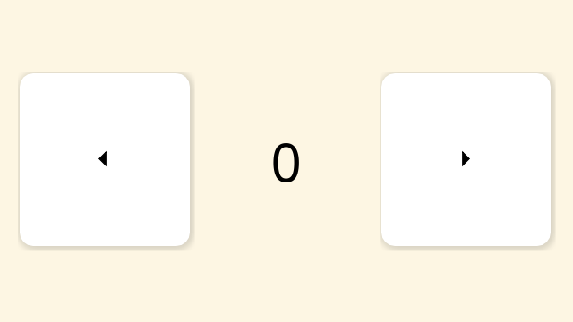

# cairo shadow button

This shows how to create a rounded button with a blur effect using cairo.

[Implementation](https://github.com/fltk-rs/flemish/tree/main/demos/cairo_shadow_button) is an  on [ELM](https://github.com/fltk-rs/flemish)

